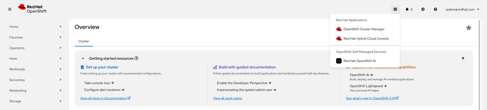
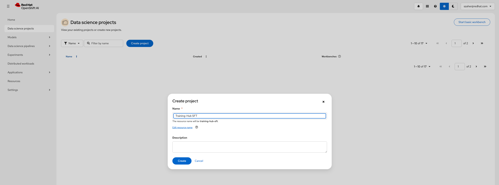
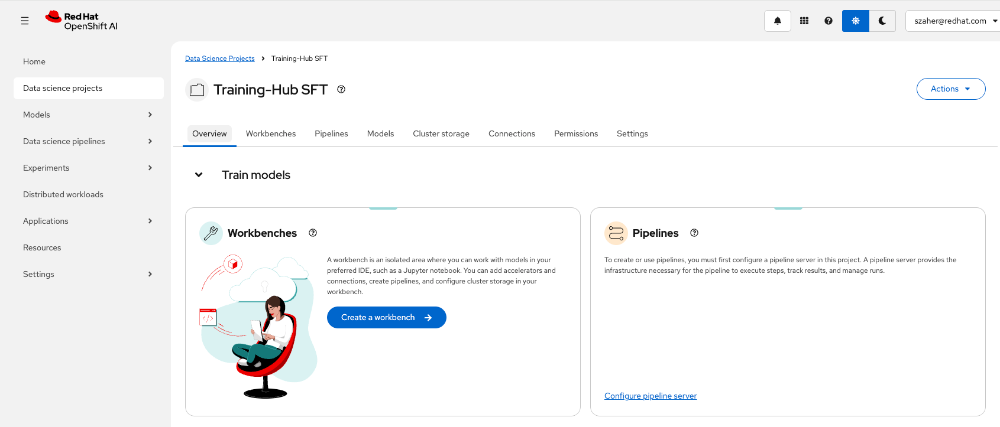
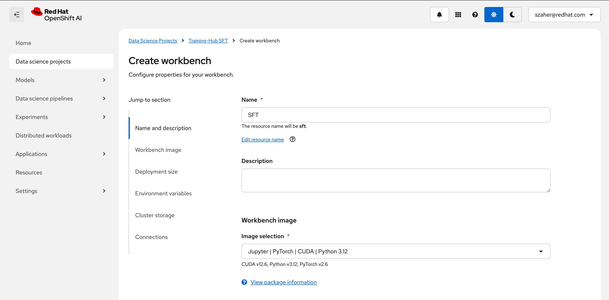
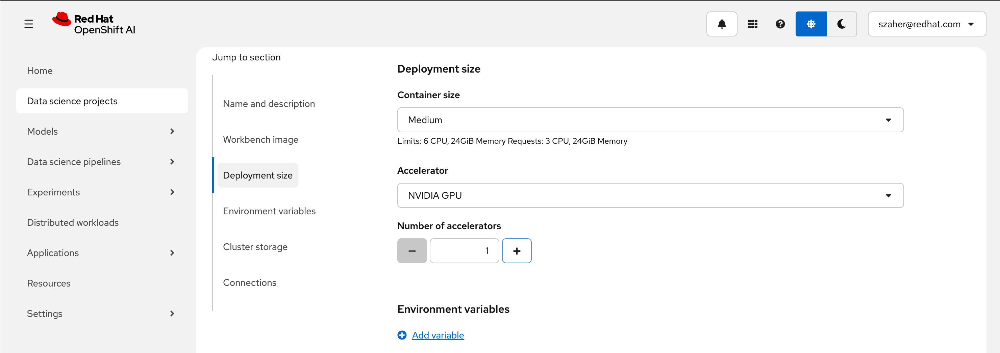
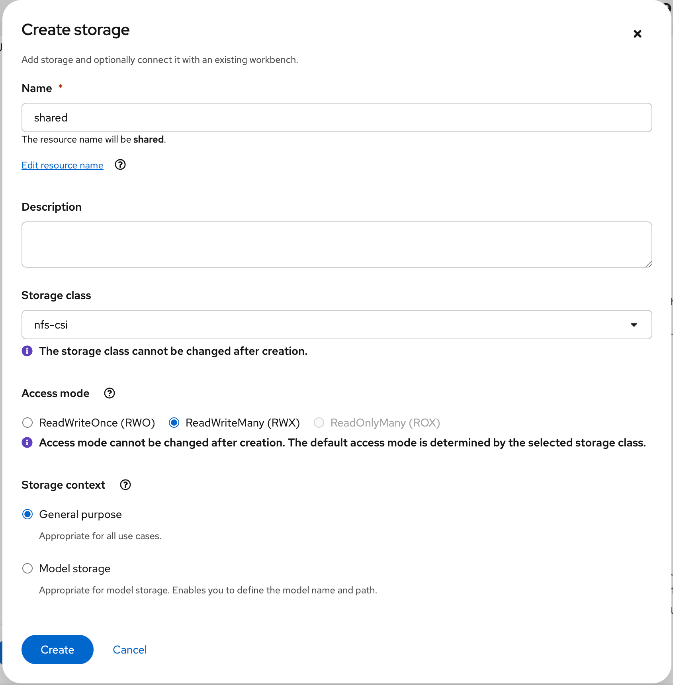
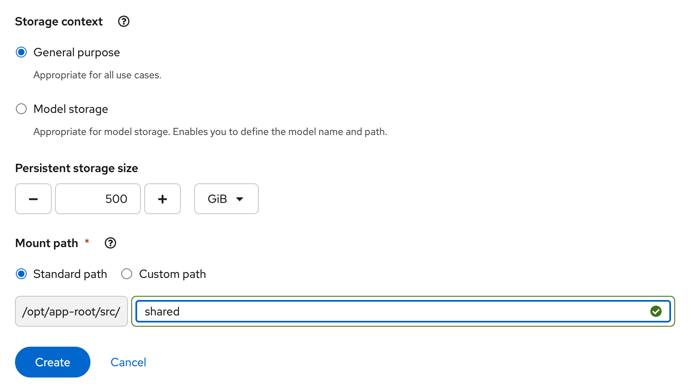
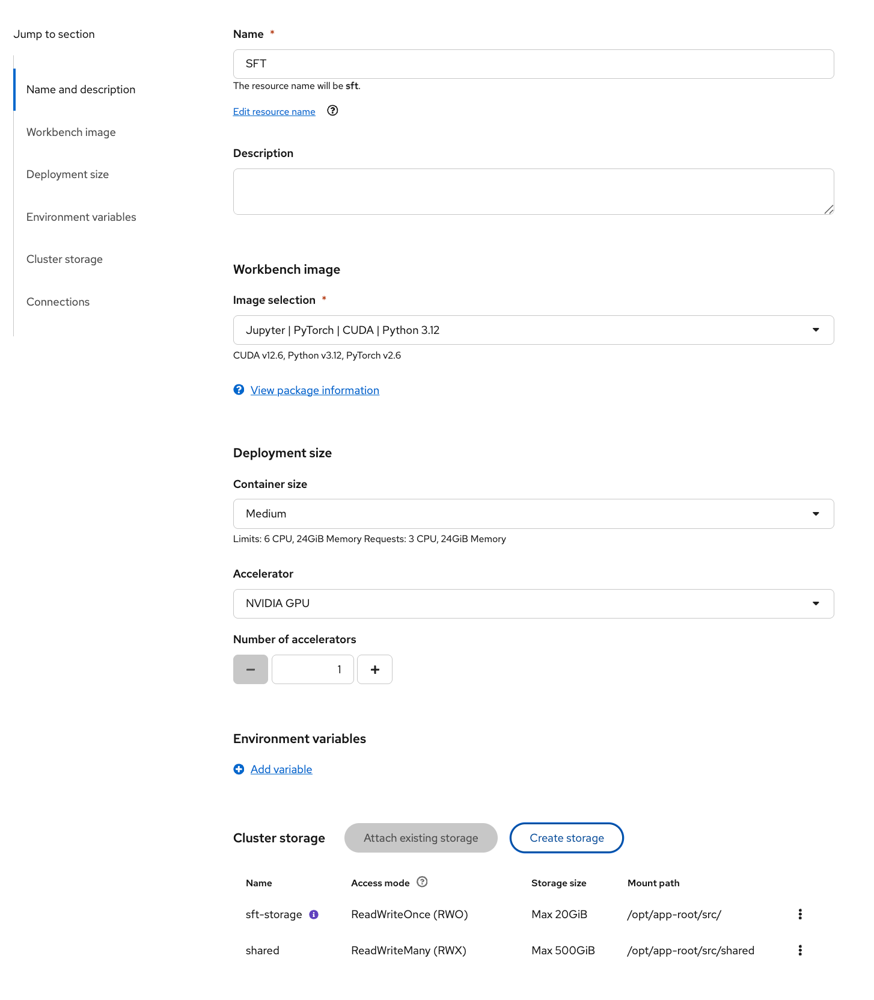
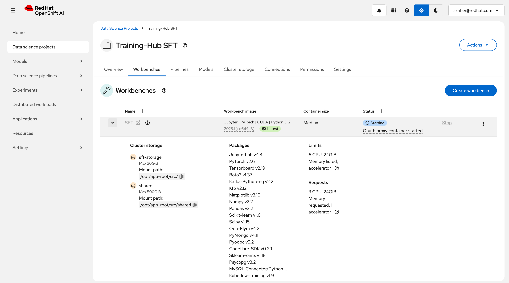

# SFT Fine-Tuning with Kubeflow Training on OpenShift AI

This example demonstrates how to fine-tune LLMs with Training Hub and the Kubeflow Trainer on OpenShift AI.
It uses Training-Hub SFT and PyTorch FSDP to distribute the training on multiple GPUs / nodes.

> [!IMPORTANT]
> This example has been tested with the configurations listed in the [validation](#validation) section.
> If you have different hardware configuration you can check [training-hub memory estimator](https://github.com/Red-Hat-AI-Innovation-Team/training_hub/tree/main/examples#memory-estimation-experimental--in-development) to validate your
> hardware configuration will be sufficient to run this example.

## Requirements

* An OpenShift cluster with OpenShift AI (RHOAI) 3.2 installed:
  * The `dashboard`, `trainingoperator` and `workbenches` components enabled
* Sufficient worker nodes for your configuration(s) with NVIDIA GPUs (Ampere-based or newer recommended).
* A dynamic storage provisioner supporting RWX PVC provisioning. Talk to your cluster administrator about RWX storage options.

## Setup

### Setup Workbench

* Access the OpenShift AI dashboard, for example from the top navigation bar menu:

* Log in, then go to _Data Science Projects_ and create a project:

* Once the project is created, click on _Create a workbench_:

* Then create a workbench with the following settings:
  * Select the `Jupyter | PyTorch | CUDA | Python 3.12`  notebook image:
    
  * Select the `Medium` container size and add an accelerator:
    
    > [!NOTE]
    > Adding an accelerator is only needed to test the fine-tuned model from within the workbench so you can spare an accelerator if needed.
  * Create a storage that'll be shared between the workbench and the fine-tuning runs.
    Make sure it uses a storage class with RWX capability and give it enough size according to the size of the model you want to fine-tune:
    
    
    > [!NOTE]
    > You can attach an existing shared storage if you already have one instead.
  * Review the configuration and click "Create workbench":
    
* From "Workbenches" page, click on _Open_ when the workbench you've just created becomes ready:

* From the workbench, clone this repository, i.e., `https://github.com/Red-hat-data-services/red-hat-ai-examples`

* Navigate to the `red-hat-ai-examples/examples/fine-tuning/rhoai-3.2/training-hub/sft` directory and open the `sft` notebook

> [!IMPORTANT]
>
> * You will need a Hugging Face token if using gated models:
>   * The examples use gated Llama models that require a token (e.g., <https://huggingface.co/Qwen/Qwen2.5-1.5B-Instruct>)
>   * Set the `HF_TOKEN` environment variable in your job configuration
>   * Note: You can skip the token if switching to non-gated models
> * This example supports Kueue integration for workload management:
>   * When using Kueue:
>     * Follow the [Configure Kueue (Optional)](#configure-kueue-optional) section to set up required resources
>     * Add the local-queue name label to your job configuration to enforce workload management
>   * You can skip Kueue usage by:
>
>       > [!NOTE]
>       > Kueue Enablement via Validating Admission Policy was introduced in RHOAI 2.21. You can skip this section if using an earlier RHOAI release version.
>
>     * Disabling the existing `kueue-validating-admission-policy-binding`
>     * Omitting the local-queue-name label in your job configuration

You can now proceed with the instructions from the notebook. Enjoy!

### Configure Kueue (Optional)

> [!NOTE]
> This section is only required if you plan to use Kueue for workload management  or
> Kueue is not already configured in your cluster.
> Resources below can be found in the [distributed-workloads repository](https://github.com/opendatahub-io/distributed-workloads/tree/main/workshops/kueue)

* Update the `nodeLabels` in the `workshops/kueue/resources/resource_flavor.yaml` file to match your AI worker nodes
* Create the ResourceFlavor:

    ```console
    oc apply -f workshops/kueue/resources/resource_flavor.yaml
    ```

* Create the ClusterQueue:

    ```console
    oc apply -f workshops/kueue/resources/team1_cluster_queue.yaml
    ```

* Create a LocalQueue in your namespace:

    ```console
    oc apply -f workshops/kueue/resources/team1_local_queue.yaml -n <your-namespace>
    ```

## Validation

This example has been validated with the following configurations:

### Qwen2.5 1.5B Instruct - TableGPT Dataset - Training-Hub - 4x NVIDIA A100/80G

* Infrastructure:
  * OpenShift AI 3.0
  * 8x NVIDIA-A100-SXM4-80GB
* Configuration:

    ```yaml
  # ################################################################################
  # # 🤖 Model + Data Paths                                                          #
  # ################################################################################
  base_model: "/mnt/shared/Qwen/Qwen2.5-1.5B-Instruct"
  dataset_path: "/mnt/shared/table-gpt-data/train/train_All_5000.jsonl"
  checkpoints_path: "/mnt/shared/checkpoints"
  # for quicker multi-process loading of datasets set this to /dev/shm
  data_output_path: "/mnt/shared/traininghub-sft-data"

  # ################################################################################
  # # 🏋️‍♀️ Training Hyperparameters                                                     #
  # ################################################################################
  # Standard parameters
  batch_size: 128
  learning_rate: 5.0e-6  # You can also write this as 0.000005
  num_epochs: 1
  lr_scheduler: "cosine"
  warmpup_steps: 0
  seed: 42

  # ################################################################################
  # # 🏎️ Performance Hyperparameters                                                  #
  # ################################################################################
  max_tokens_per_gpu: 10000
  max_seq_len: 8192

  # ################################################################################
  # # 💾 Checkpointing Settings                                                      #
  # ################################################################################
  checkpoint_at_epoch: true
  save_full_optim_state: false

  # ###############################################################################
  # # 🔥 TORCHRUN SETTINGS will be injected automatically by Kubeflow Trainer      #
  # ###############################################################################
    ```

* Job:

    ```yaml
    num_workers: 4
    num_procs_per_worker: 1
    resources_per_worker:
      "nvidia.com/gpu": 1
      "memory": 64Gi
      "cpu": 4
    base_image: quay.io/modh/training:py312-cuda128-torch280
    env_vars:
      "PYTORCH_CUDA_ALLOC_CONF": "expandable_segments:True"
      "NCCL_DEBUG": "INFO"
    ```

### Qwen2.5 7B Instruct - TableGPT Dataset - Training-Hub - 4x NVIDIA A100/80G

* Infrastructure:
  * OpenShift AI 3.0
  * 8x NVIDIA-A100-SXM4-80GB
* Configuration:

    ```yaml
  # ################################################################################
  # # 🤖 Model + Data Paths                                                          #
  # ################################################################################
  base_model: "/mnt/shared/Qwen/Qwen2.5-7B-Instruct"
  dataset_path: "/mnt/shared/table-gpt-data/train/train_All_5000.jsonl"
  checkpoints_path: "/mnt/shared/checkpoints"
  # for quicker multi-process loading of datasets set this to /dev/shm
  data_output_path: "/mnt/shared/traininghub-sft-data"

  # ################################################################################
  # # 🏋️‍♀️ Training Hyperparameters                                                     #
  # ################################################################################
  # Standard parameters
  batch_size: 128
  learning_rate: 5.0e-6  # You can also write this as 0.000005
  num_epochs: 1
  lr_scheduler: "cosine"
  warmpup_steps: 0
  seed: 42

  # ################################################################################
  # # 🏎️ Performance Hyperparameters                                                  #
  # ################################################################################
  max_tokens_per_gpu: 10000
  max_seq_len: 8192

  # ################################################################################
  # # 💾 Checkpointing Settings                                                      #
  # ################################################################################
  checkpoint_at_epoch: true
  save_full_optim_state: false

  # ###############################################################################
  # # 🔥 TORCHRUN SETTINGS will be injected automatically by Kubeflow Trainer      #
  # ###############################################################################
    ```

* Job:

    ```yaml
    num_workers: 4
    num_procs_per_worker: 1
    resources_per_worker:
      "nvidia.com/gpu": 1
      "memory": 64Gi
      "cpu": 4
    base_image: quay.io/modh/training:py312-cuda128-torch280
    env_vars:
      "PYTORCH_CUDA_ALLOC_CONF": "expandable_segments:True"
      "NCCL_DEBUG": "INFO"
    ```

### Qwen2.5 14B Instruct - TableGPT Dataset - Training-Hub - 4x NVIDIA A100/80G

* Infrastructure:
  * OpenShift AI 3.0
  * 8x NVIDIA-A100-SXM4-80GB
* Configuration:

    ```yaml
  # ################################################################################
  # # 🤖 Model + Data Paths                                                          #
  # ################################################################################
  base_model: "/mnt/shared/Qwen/Qwen2.5-14B-Instruct"
  dataset_path: "/mnt/shared/table-gpt-data/train/train_All_5000.jsonl"
  checkpoints_path: "/mnt/shared/checkpoints"
  # for quicker multi-process loading of datasets set this to /dev/shm
  data_output_path: "/mnt/shared/traininghub-sft-data"

  # ################################################################################
  # # 🏋️‍♀️ Training Hyperparameters                                                     #
  # ################################################################################
  # Standard parameters
  batch_size: 128
  learning_rate: 5.0e-6  # You can also write this as 0.000005
  num_epochs: 1
  lr_scheduler: "cosine"
  warmpup_steps: 0
  seed: 42

  # ################################################################################
  # # 🏎️ Performance Hyperparameters                                                  #
  # ################################################################################
  max_tokens_per_gpu: 10000
  max_seq_len: 8192

  # ################################################################################
  # # 💾 Checkpointing Settings                                                      #
  # ################################################################################
  checkpoint_at_epoch: true
  save_full_optim_state: false

  # ###############################################################################
  # # 🔥 TORCHRUN SETTINGS will be injected automatically by Kubeflow Trainer      #
  # ###############################################################################
    ```

* Job:

    ```yaml
    num_workers: 4
    num_procs_per_worker: 1
    resources_per_worker:
      "nvidia.com/gpu": 1
      "memory": 64Gi
      "cpu": 4
    base_image: quay.io/modh/training:py312-cuda128-torch280
    env_vars:
      "PYTORCH_CUDA_ALLOC_CONF": "expandable_segments:True"
      "NCCL_DEBUG": "INFO"
    ```
